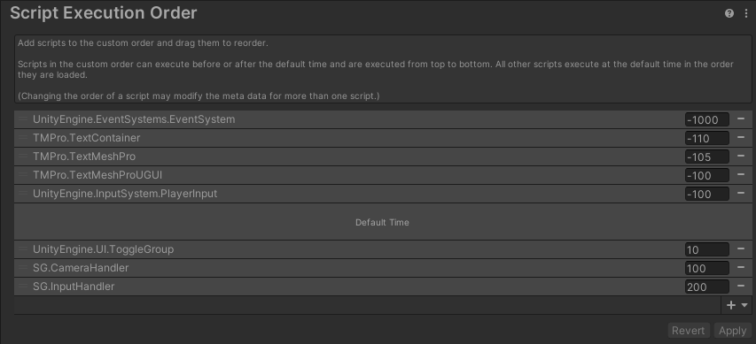

# Unity Game - Dark Soul 实践

### 1. Movement

#### Input System


#### Workflow


Action Asset：An asset type which contains a saved configuration of Action Maps, Actions and Bindings，能够为不同的场景（步行或载具）创建Action Map，为不同的设备创建Control Scheme

### 2. Camera Handler

#### 相机更随

```c#
Vector3 targetPosition = Vector3.Lerp(myTransform.position, targetTransform.position, delta / followSpeed);
myTransform.position = targetPosition;
```

#### 视角转动

 

Camera Holder控制绕 **Y** 轴方向的转动，Camera Pivot控制绕 **Local X** 轴方向的转动。

#### 执行顺序

 

 

因为InputHandler需要用到CameraHandler的单例，所以CameraHandler Script的执行顺序要先于InputHandler Script

### 3. Cinemachine

改用Cinemachine了（滑稽）

#### FreeLook

为Top、Middle和Bottom设置了三个旋转轨道，高度在范围内的相机的位置会自动混合

#### Cinemachine Collider

可以自动调节相机的位置以避免遮挡

#### 类魂镜头实现：

用实现了一个延迟移动的鬼影，将FreeLook的Follow和Aim都所在了鬼影上

```C#
void Update()
{
	Vector3 position = Vector3.Lerp(this.transform.position, player.position, speed * Time.deltaTime);
	this.transform.position = position;
}
```

### 4. Root Motion

#### **Apply Root Motion**

当你使用的骨骼动画会使得整个对象发生位移或偏转的时候，勾选Animator下的Apply Root Motion选项，会将位移和偏转实时附加到父物体上。

#### **Bake into Pose**

将整个骨骼动画对角色产生的位移和偏转，转化为姿势，或者说BodyPose，接下来无论你是否勾选Apply Root Motion，都将不会使得父级的Transform发生变化。（直到你勾选Apply Root Motion并使用第二个动画为止）


**使用Ctrl+d 从fbx文件中提取anim动画**

### 5. Function Structure

 

### 6. Falling and Landing
